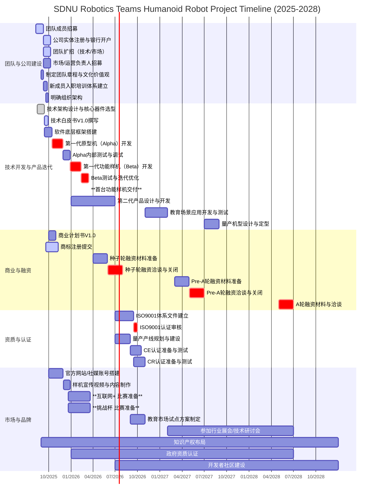

```mermaid
gantt
    title SDNU Robotics Teams Humanoid Robot Project Timeline (2025-2028)
    dateFormat  YYYY-MM-DD
    axisFormat  %m/%Y
    
    section 团队与公司建设
    团队成员招募              :active, hr1, 2025-08-10, 2025-09-10
    公司实体注册与银行开户      :active, corp, after hr1, 30d
    团队扩招（技术/市场）       :active, hr2, after hr1, 30d
    市场/运营负责人招募         :hr_mkt1, after hr1, 30d
    制定团队章程与文化价值观     :culture, 2025-09-01, 2025-09-10
    新成员入职培训体系建立       :training, after culture, 15d
    明确组织架构                :org_struct, 2025-09-20, 2025-09-30

    
    section 技术开发与产品迭代
    技术架构设计与核心器件选型  :done,     tech_arch, 2025-08-16, 2025-09-15
    技术白皮书V1.0撰写         :active,  doc, after tech_arch, 15d
    软件底层框架搭建           :         soft_frame, after tech_arch, 30d
    第一代原型机（Alpha）开发   :crit,    alpha, after soft_frame, 45d
    Alpha内部测试与调试        :         test_alpha, after alpha, 30d
    第一代功能样机（Beta）开发  :crit,    mvp_dev, after test_alpha, 45d
    Beta测试与迭代优化         :crit,    mvp_test, after mvp_dev, 30d
    **首台功能样机交付**       :crit,    mvp, after mvp_test, 1d
    第二代产品设计与开发        :         ver2, 2026-01-01, 2026-06-30
    教育场景应用开发与测试      :         edu_dev, 2026-11-01, 2027-01-31
    量产机型设计与定型         :         mass_prod_design, 2027-07-01, 2027-08-31

   section 商业与融资
    商业计划书V1.0            :         bp1, 2025-10-01, 2025-10-31
    商标注册提交              :active,  tm, 2025-09-20, 2025-11-10
    种子轮融资材料准备         :         seed_prep, 2026-04-01, 2026-05-31
    种子轮融资洽谈与关闭       :crit,    seed, 2026-06-01, 2026-07-31
    Pre-A轮融资材料准备        :         prea_prep, 2027-03-01, 2027-04-30
    Pre-A轮融资洽谈与关闭      :crit,    prea, 2027-05-01, 2027-06-30
    A轮融资材料与洽谈         :crit,    seria, 2028-05-01, 2028-06-30

    section 资质与认证
    ISO9001体系文件建立       :         iso_doc, 2026-07-01, 2026-09-15
    ISO9001认证审核           :crit,    iso_audit, after iso_doc, 15d
    量产产线规划与建设         :         prod_line, 2026-07-01, 2026-08-31
    CE认证准备与测试          :         ce_prep, 2026-09-01, 2026-10-15
    CR认证准备与测试          :         cr_prep, 2026-09-15, 2026-10-31
    
    section 市场与品牌
    官方网站/社媒账号搭建      :         brand_online, 2025-10-01, 2025-11-30
    样机宣传视频与内容制作     :         mvp_mkt, 2025-12-01, 2025-12-29
    **互联网+ 比赛准备**      :         comp_net, 2025-12-20, 2026-03-20
    **挑战杯 比赛准备**       :         comp_challenge, 2025-12-20, 2026-03-20
    教育市场试点方案制定       :         edu_plan, 2026-09-01, 2026-10-31
    参加行业展会/技术研讨会    :         event, 2027-02-01, 2028-06-30
    知识产权布局        :           ip, 2025-09-01, 2028-12-31
    政府资质认证        :           cert, 2026-01-01, 2028-06-30
    开发者社区建设      :           comm, 2026-07-01, 2028-12-31
    
```

Mermaid甘特图支持以下语法：
- `:done` - 已完成的任务
- `:active` - 当前进行中的任务
- `after task_name` - 任务依赖关系
- `section` - 任务分组
